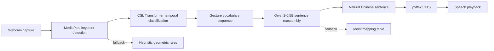

<div align="center">

# Sign Language Translation

### Real-Time Sign Language Recognition & Speech Synthesis based on Transformer

Make the silent heard

[](LICENSE)
[](https://www.python.org/)
[](https://pytorch.org/)
[](https://fastapi.tiangolo.com/)

English | [中文](README.md)


</div>

---

## Overview

An end-to-end real-time sign language recognition and speech synthesis platform. The user signs in front of a webcam; the system automatically recognizes gesture vocabulary, reassembles it into natural Chinese sentences, and synthesizes speech for playback. A pure-vision approach — no data gloves or expensive hardware required, just an ordinary webcam.

```
Webcam → MediaPipe keypoint extraction → CSL Transformer temporal classification → Qwen2 sentence reassembly → pyttsx3 speech synthesis
```

## Pipeline



## Features

- **Real-time recognition** — WebSocket frame streaming, MediaPipe + CSL Transformer per-frame classification, 30fps+ on CPU
- **LLM sentence reassembly** — Qwen2-0.5B + prompt engineering + few-shot, vocabulary sequence → fluent sentence
- **Multi-layer fallback** — missing weights → heuristic rules; Qwen2 failure → mock mapping table; no GPU → CPU inference
- **Offline TTS** — pyttsx3 local speech synthesis, no network, no API cost
- **ONNX deployment** — int8 quantization export, runs without PyTorch, 2–3× CPU inference speedup
- **Pre-trained weights bundled** — clone & run, no extra downloads (Qwen2 auto-downloads on first launch)

## Supported Gestures (26 classes)

`我` `你` `喜欢` `谢谢` `对不起` `没关系` `你好` `为什么` `谁` `在` `去` `吃` `很` `会` `大家` `一起` `面包` `上次` `开心` `祝` `帮助` `请` `问` `快点` `想要` `手语`

> Custom vocabulary extension is supported — see [Model Training](#model-training).

---

## Quick Start

> For full environment setup, see [SETUP.md](SETUP.md).

```bash
git clone https://github.com/pzzzwww/Sign-Language-Translation.git
cd Sign-Language-Translation
pip install -r requirements.txt
python -m src.backend.main
```

Qwen2-0.5B (~1GB) auto-downloads on first launch via `hf-mirror.com` mirror. Open **https://localhost:8000** in browser → allow camera → start signing.

<details>
<summary>Other launch options</summary>

```bash
# Disable HTTPS (self-signed cert)
NO_SSL=1 python -m src.backend.main

# Skip model download, use mapping table instead (zero-dependency mode)
# Edit src/config.py: TRANSLATION_MODE = "mock"

# Switch back to official HuggingFace endpoint
HF_ENDPOINT=https://huggingface.co python -m src.backend.main
```

</details>

---

## Tech Stack

| Layer | Technology | Description |
|-------|-----------|-------------|
| Web framework | FastAPI + Uvicorn | Async REST + WebSocket |
| Hand detection | MediaPipe | 21-point hand keypoints, real-time |
| Temporal classification | CSL Transformer Encoder | 4-layer 8-head self-attention + Pre-LN + learnable positional encoding |
| Sentence reassembly | Qwen2-0.5B-Instruct | prompt engineering + few-shot |
| Speech synthesis | pyttsx3 | Offline TTS (Windows SAPI5 / Linux espeak) |
| Storage | SQLite | Translation history CRUD |
| Frontend | Vanilla HTML/CSS/JS | Zero framework dependency |

**Design patterns**: Strategy (abstract interface, swappable impl) · Facade (wraps MediaPipe + CSL subsystem) · Singleton (model singleton, avoids reload) · Graceful degradation (fallback at every layer)

---

## Project Structure

```
src/
├── backend/main.py                  # FastAPI entry (lifespan manages model lifecycle)
├── api/routes.py                    # REST API
├── websocket/handler.py             # WebSocket real-time recognition
├── config.py                        # Centralized config
├── interfaces/                      # Abstract interfaces (Strategy)
├── models/
│   ├── sign_language_model/         # MediaPipe detection + CSL Transformer classification
│   └── text_model/                  # Qwen2 sentence reassembly + Mock fallback
├── services/                        # Business service layer (recognize/translate/TTS/history)
scripts/
├── collect_data.py                  # Gesture data collection
├── train_csl.py                     # CSL Transformer training
├── export_onnx.py                   # ONNX export + int8 quantization
└── gradio_app.py                    # Gradio demo
frontend/                            # Vanilla HTML/CSS/JS
```

**Architecture**: WebSocket `/ws/stream` handles real-time webcam streaming (independent recognition session per connection); REST `/api/*` handles video upload / translate / TTS / history. Models are pre-loaded at `lifespan` startup and released on shutdown.

---

## API

### REST

| Method | Endpoint | Description |
|--------|----------|-------------|
| GET | `/api/health` | Health check |
| GET | `/api/status` | Model load status |
| POST | `/api/translate` | Vocabulary list → sentence |
| POST | `/api/tts` | Text → WAV audio |
| POST | `/api/process-video` | Upload video → recognize + reassemble |
| POST | `/api/confirm-video` | Confirm translation + generate speech |
| GET | `/api/history` | Translation history list |
| DELETE | `/api/history/{id}` | Delete history record |

### WebSocket `/ws/stream`

`start_capture` · `process_frame` · `confirm_token` · `delete_token` · `clear_tokens` · `stop` · `confirm_translate` · `generate_audio` · `confirm_and_generate`

---

## Configuration

All config is centralized in `src/config.py`. Key options:

| Option | Default | Description |
|--------|---------|-------------|
| `TRANSLATION_MODE` | `"qwen"` | Sentence reassembly mode: `qwen` / `mock` / `auto` |
| `CSL_CONFIDENCE_THRESHOLD` | `0.55` | Confidence threshold |
| `CSL_STABILITY_THRESHOLD` | `5` | Consecutive frames required to confirm |
| `CSL_COOLDOWN_FRAMES` | `30` | Cooldown frames after confirmation |
| `REALTIME_RECOGNIZE_INTERVAL` | `12` | Recognize every N frames |

---

## Model Training

```bash
# 1. Collect data (20–50 clips per gesture, vary angle/distance/speed)
python scripts/collect_data.py

# 2. Train CSL Transformer
python scripts/train_csl.py --epochs 60 --batch 16 --lr 5e-4

# 3. Export ONNX (with int8 quantization)
python scripts/export_onnx.py
```

Training pipeline: sliding-window segmentation → class weighting / oversampling → training → early stopping → confusion matrix. Built-in data augmentation (Gaussian noise, time masking, scale transform, speed variation, keypoint dropout).

---

## Roadmap

- [ ] Continuous sign language recognition (CTC instead of isolated words)
- [ ] End-to-end multimodal LLM (Qwen2-VL)
- [ ] Mobile app (ONNX → TFLite)
- [ ] More TTS engine support

---

## FAQ

<details>
<summary>Camera won't open?</summary>
Edit `CAMERA_INDEX` in `src/config.py`. On Windows it's usually 0 or 1.
</details>

<details>
<summary>Model download is slow?</summary>
Defaults to `hf-mirror.com` mirror. If still slow, set `TRANSLATION_MODE = "mock"` to skip, or `HF_ENDPOINT=https://huggingface.co` to use the official source.
</details>

<details>
<summary>No audio from TTS?</summary>
Linux requires `sudo apt install espeak`. Windows/macOS have it built-in.
</details>

<details>
<summary>Browser warns about insecure certificate?</summary>
A self-signed SSL certificate is used locally. Click "Advanced → Proceed" to continue, or set `NO_SSL=1` to use plain HTTP.
</details>

---

## License

[MIT](LICENSE) © 2026 [pzzzwww](https://github.com/pzzzwww)
