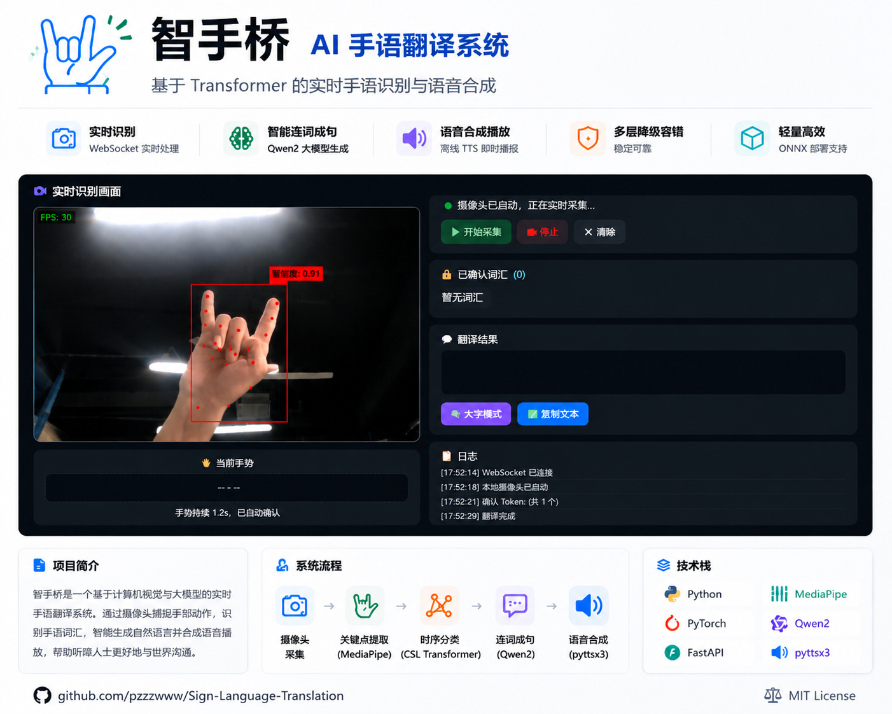
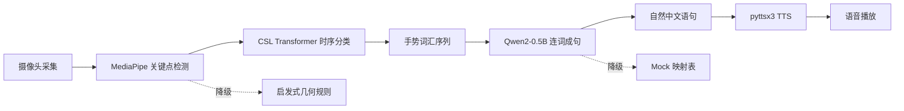

<div align="center">

# Sign Language Translation

### 基于 Transformer 的实时手语识别与语音合成系统

让无声的表达被听见

[](LICENSE)
[](https://www.python.org/)
[](https://pytorch.org/)
[](https://fastapi.tiangolo.com/)



</div>

---

## 概述

端到端实时手语识别与语音合成平台。用户通过摄像头比划手语，系统自动识别手势词汇、重组为自然中文语句、合成语音播放。纯视觉方案，无需数据手套等昂贵硬件，普通摄像头即可使用。

```
摄像头 → MediaPipe 关键点提取 → CSL Transformer 时序分类 → Qwen2 连词成句 → pyttsx3 语音合成
```

## 核心流程



## 特性

- **实时识别** — WebSocket 帧推流，MediaPipe + CSL Transformer 逐帧分类，CPU 30fps+
- **大模型连词成句** — Qwen2-0.5B + prompt engineering + few-shot，词汇序列 → 通顺句子
- **多层降级** — 权重缺失自动切换启发式规则；Qwen2 失败回退 Mock 映射表；无 GPU 走 CPU
- **离线 TTS** — pyttsx3 本地语音合成，不联网、不花 API 费
- **ONNX 部署** — 支持 int8 量化导出，脱离 PyTorch，CPU 推理加速 2~3 倍
- **预训练权重内置** — 克隆即可用，无需额外下载（Qwen2 首次启动自动获取）

## 支持手势（26 类）

`我` `你` `喜欢` `谢谢` `对不起` `没关系` `你好` `为什么` `谁` `在` `去` `吃` `很` `会` `大家` `一起` `面包` `上次` `开心` `祝` `帮助` `请` `问` `快点` `想要` `手语`

> 支持自定义词汇表扩展，见[模型训练](#模型训练)。

---

## 快速开始

> 完整环境配置步骤见 [SETUP.md](SETUP.md)。

```bash
git clone https://github.com/pzzzwww/Sign-Language-Translation.git
cd Sign-Language-Translation
pip install -r requirements.txt
python -m src.backend.main
```

首次启动自动下载 Qwen2-0.5B（约 1GB，走 `hf-mirror.com` 国内镜像）。浏览器打开 **https://localhost:8000** → 允许摄像头 → 比划手势。

<details>
<summary>其他启动选项</summary>

```bash
# 不走 HTTPS（自签名证书）
NO_SSL=1 python -m src.backend.main

# 不下载模型，用映射表代替（零依赖模式）
# 修改 src/config.py: TRANSLATION_MODE = "mock"

# 国际用户切回 HuggingFace 官方源
HF_ENDPOINT=https://huggingface.co python -m src.backend.main
```

</details>

---

## 技术栈

| 层级 | 技术 | 说明 |
|------|------|------|
| Web 框架 | FastAPI + Uvicorn | 异步 REST + WebSocket |
| 手部检测 | MediaPipe | 21 点手部关键点实时提取 |
| 时序分类 | CSL Transformer Encoder | 4 层 8 头自注意力 + Pre-LN + 可学习位置编码 |
| 词汇重组 | Qwen2-0.5B-Instruct | prompt engineering + few-shot |
| 语音合成 | pyttsx3 | 离线 TTS（Windows SAPI5 / Linux espeak） |
| 数据存储 | SQLite | 翻译历史 CRUD |
| 前端 | 原生 HTML/CSS/JS | 零框架依赖 |

**设计模式**：Strategy（抽象接口，实现可替换）· Facade（封装 MediaPipe + CSL 子系统）· Singleton（模型单例，避免重复加载）· 降级容错（每层备选方案）

---

## 项目结构

```
src/
├── backend/main.py                  # FastAPI 入口（lifespan 管理模型生命周期）
├── api/routes.py                    # REST API
├── websocket/handler.py             # WebSocket 实时识别
├── config.py                        # 集中配置
├── interfaces/                      # 抽象接口（Strategy）
├── models/
│   ├── sign_language_model/         # MediaPipe 检测 + CSL Transformer 分类
│   └── text_model/                  # Qwen2 连词成句 + Mock 降级
├── services/                        # 业务服务层（识别/翻译/TTS/历史）
scripts/
├── collect_data.py                  # 手势数据采集
├── train_csl.py                     # CSL Transformer 训练
├── export_onnx.py                   # ONNX 导出 + int8 量化
└── gradio_app.py                    # Gradio 演示
frontend/                            # 原生 HTML/CSS/JS
```

**架构**：WebSocket `/ws/stream` 处理摄像头实时推流（每连接独立识别会话），REST `/api/*` 处理视频上传/翻译/TTS/历史。模型在 `lifespan` 启动时预加载，关闭时释放。

---

## API

### REST

| 方法 | 端点 | 说明 |
|------|------|------|
| GET | `/api/health` | 健康检查 |
| GET | `/api/status` | 模型加载状态 |
| POST | `/api/translate` | 词汇列表 → 句子 |
| POST | `/api/tts` | 文本 → WAV 音频 |
| POST | `/api/process-video` | 上传视频 → 识别 + 重组 |
| POST | `/api/confirm-video` | 确认翻译 + 生成语音 |
| GET | `/api/history` | 翻译历史列表 |
| DELETE | `/api/history/{id}` | 删除历史记录 |

### WebSocket `/ws/stream`

`start_capture` · `process_frame` · `confirm_token` · `delete_token` · `clear_tokens` · `stop` · `confirm_translate` · `generate_audio` · `confirm_and_generate`

---

## 配置

所有配置集中在 `src/config.py`，主要项：

| 配置项 | 默认值 | 说明 |
|--------|--------|------|
| `TRANSLATION_MODE` | `"qwen"` | 连词成句模式：`qwen` / `mock` / `auto` |
| `CSL_CONFIDENCE_THRESHOLD` | `0.55` | 置信度阈值 |
| `CSL_STABILITY_THRESHOLD` | `5` | 连续 N 帧一致才确认 |
| `CSL_COOLDOWN_FRAMES` | `30` | 确认后冷却帧数 |
| `REALTIME_RECOGNIZE_INTERVAL` | `12` | 每隔 N 帧识别一次 |

---

## 模型训练

```bash
# 1. 采集数据（每个手势 20-50 段，变换角度/距离/速度）
python scripts/collect_data.py

# 2. 训练 CSL Transformer
python scripts/train_csl.py --epochs 60 --batch 16 --lr 5e-4

# 3. 导出 ONNX（含 int8 量化）
python scripts/export_onnx.py
```

训练流程：滑动窗口切分 → 类别加权/过采样 → 训练 → 早停 → 混淆矩阵。内置数据增强（高斯噪声、时间遮蔽、尺度变换、速度变化、关键点丢弃）。

---

## Roadmap

- [ ] 连续手语识别（CTC 替代孤立词）
- [ ] 多模态 LLM 端到端（Qwen2-VL）
- [ ] 移动端 App（ONNX → TFLite）
- [ ] 更多 TTS 引擎支持

---

## FAQ

<details>
<summary>摄像头打不开？</summary>
修改 `src/config.py` 中 `CAMERA_INDEX`，Windows 通常为 0 或 1。
</details>

<details>
<summary>模型下载慢？</summary>
默认走 `hf-mirror.com` 镜像。仍慢可设 `TRANSLATION_MODE = "mock"` 跳过，或 `HF_ENDPOINT=https://huggingface.co` 切官方源。
</details>

<details>
<summary>语音没有声音？</summary>
Linux 需 `sudo apt install espeak`。Windows/macOS 系统自带。
</details>

<details>
<summary>浏览器提示证书不安全？</summary>
自签名 SSL 证书，点「高级 → 继续访问」即可，或 `NO_SSL=1` 走 HTTP。
</details>

---

## License

[MIT](LICENSE) © 2026 [pzzzwww](https://github.com/pzzzwww)
