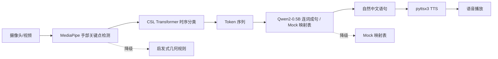

# 基于 Transformer 的手语识别生成语音系统

> 实时手语识别与语音合成平台 — 让无声的表达被听见。

[](LICENSE)

## 项目简介

端到端的实时手语识别与语音合成系统。用户通过**摄像头实时采集**或**上传视频文件**输入手语，系统自动识别手势词汇、将词汇序列重组为自然中文语句，并合成为可播放的语音。

### 核心流程



### 特性

- **实时手语识别**：WebSocket 摄像头帧推流，MediaPipe + CSL Transformer 逐帧分类
- **大模型连词成句**：Qwen2-0.5B-Instruct + prompt engineering + few-shot，将词汇序列重组为通顺中文句子
- **离线 TTS**：pyttsx3 本地语音合成，无需网络
- **多层降级**：CSL 权重缺失 → 启发式几何规则；Qwen2 加载失败 → Mock 映射表；GPU 不可用 → CPU 推理
- **REST API 视频处理**：`/api/process-video` 支持上传视频文件识别（后端接口，前端界面为摄像头实时模式）
- **翻译历史**：SQLite 持久化存储，支持回放、删除
- **预训练权重**：仓库内置手语识别权重，克隆即可用
- **ONNX 部署**：支持 ONNX 导出 + int8 量化，脱离 PyTorch 部署

### 支持的手势词汇（26 类）

| 手语 | 对不起 | 你 | 去 | 很 | 上次 | 会 | 大家 | 喜欢 | 面包 |
| 一起 | 我 | 吃 | 为什么 | 谢谢 | 开心 | 祝 | 帮助 | 请 | 问 |
| 快点 | 没关系 | 谁 | 在 | 想要 | | | | | |

> 模型训练支持自定义词汇表，可扩展任意新手势。

---

## 技术栈

| 层级 | 技术 | 说明 |
|------|------|------|
| Web 框架 | FastAPI + Uvicorn | 异步 REST + WebSocket |
| 实时通信 | WebSocket | 摄像头帧推流，双向消息 |
| 手部检测 | MediaPipe | 21 点手部关键点实时提取（CPU 30fps+） |
| 时序分类 | CSL Transformer Encoder | 4 层 8 头自注意力 + 可学习位置编码 + Pre-LN |
| 词汇重组 | Qwen2-0.5B-Instruct | prompt engineering + few-shot，词汇序列 → 自然语句 |
| 语音合成 | pyttsx3 | Windows SAPI5 离线 TTS，支持性别切换 |
| 数据存储 | SQLite | 翻译历史 CRUD |
| 前端 | 原生 HTML/CSS/JS | 零框架依赖 |

### 设计模式

- **Strategy 模式**：`SignLanguageModel` / `TextTranslateModel` 抽象接口，替换实现时业务代码零改动
- **Facade 模式**：`RealSignLanguageModel` 组合 MediaPipe + CSL 子系统，对外统一接口
- **Singleton 模式**：`TranslateService` 类级单例，避免重复加载大模型到显存
- **降级容错**：每层模型不可用时自动切换备选方案（神经网络 → 启发式规则、Qwen2 → Mock 映射表、GPU → CPU）

---

## 快速启动

### 环境要求

- Python 3.10+
- PyTorch 2.5+（建议根据显卡安装对应 CUDA 版本：[pytorch.org](https://pytorch.org/get-started/locally/)）
- 摄像头（实时模式需要）

### 安装与运行

```bash
# 克隆
git clone https://github.com/pzzzwww/Sign-Language-Translation.git
cd Sign-Language-Translation

# 安装依赖
pip install -r requirements.txt

# 启动服务（预训练权重已在仓库中）
python -m src.backend.main
```

默认启动在 **https://localhost:8000**（自签名 SSL 证书，浏览器提示不安全点「高级 → 继续」即可）。

不想走 HTTPS：
```bash
# Linux / macOS
NO_SSL=1 python -m src.backend.main

# Windows PowerShell
$env:NO_SSL=1; python -m src.backend.main
```

浏览器访问后点击「开始采集」，摄像头前比划手势即可。

> Qwen2-0.5B 首次启动自动下载（约 1GB）。如不想下载，修改 `src/config.py` 中 `TRANSLATION_MODE = "mock"`。

---

## 模型训练

### 采集数据

```bash
python scripts/collect_data.py
```

每个手势录 20-50 段，采集时故意变换角度、距离、速度以提升泛化能力。

### 训练

```bash
python scripts/train_csl.py
```

训练参数可在命令行覆盖：

```bash
python scripts/train_csl.py --epochs 60 --batch 16 --lr 5e-4
```

训练自动完成：滑动窗口切分 → 类别加权/过采样 → 训练 → 早停 → 混淆矩阵。

`train_csl.py` 内置数据增强函数 `augment_sequence`（高斯噪声、时间遮蔽、尺度变换、速度变化、关键点丢弃），在 `GestureDataset(augment=True)` 时启用。

### ONNX 导出

```bash
python scripts/export_onnx.py
```

导出训练好的 CSL Transformer 为 ONNX 格式（含 int8 量化），脱离 PyTorch 部署，CPU 推理加速 2~3 倍。

---

## 项目结构

```
├── src/
│   ├── backend/main.py              # FastAPI 应用入口（lifespan 管理模型加载/卸载）
│   ├── api/routes.py                # REST API 路由
│   ├── websocket/handler.py         # WebSocket 连接管理 + 实时识别
│   ├── config.py                    # 集中配置
│   ├── interfaces/                  # 抽象接口（Strategy 模式）
│   │   ├── sign_language_model.py   # SignLanguageModel 抽象基类
│   │   └── text_translate_model.py  # TextTranslateModel 抽象基类
│   ├── models/
│   │   ├── __init__.py              # 手语模型工厂函数 + 单例缓存
│   │   ├── sign_language_model/     # 手语识别模型
│   │   │   ├── mediapipe_detector.py    # MediaPipe 手部关键点检测
│   │   │   ├── csl_recognizer.py        # CSL Transformer 时序分类器
│   │   │   └── real_recognizer.py       # 组合识别器（MediaPipe + CSL）
│   │   └── text_model/              # 文本重组模型
│   │       ├── qwen2_translate_model.py # Qwen2-0.5B 连词成句（prompt + few-shot）
│   │       └── mock_model.py            # 轻量降级（映射表 + 模板）
│   ├── services/                    # 业务服务层
│   │   ├── sign_service.py          # 手语识别服务
│   │   ├── translate_service.py     # 词汇 → 句子（支持 qwen/mock 模式）
│   │   ├── speech_service.py        # pyttsx3 离线 TTS
│   │   ├── history_service.py       # SQLite 翻译历史 CRUD
│   │   ├── video_service.py         # 视频下载 + 抽帧
│   │   └── database.py              # 数据库连接管理
├── scripts/
│   ├── collect_data.py              # 手势数据采集
│   ├── train_csl.py                 # CSL Transformer 训练
│   ├── export_onnx.py               # ONNX 导出 + int8 量化
│   └── gradio_app.py                # Gradio 演示
├── frontend/
│   ├── index.html
│   └── static/
│       ├── css/style.css
│       └── js/main.js
├── data/gestures/                   # 训练数据目录
├── requirements.in                  # 依赖声明（pip-compile 源文件）
├── requirements.txt                 # 依赖锁文件（pip-compile 生成）
└── README.md
```

### 架构说明

**双入口设计**：

- **WebSocket `/ws/stream`** — 摄像头实时推流。客户端发送 base64 JPEG 帧，服务端逐帧分类，每个连接维护独立的 `StreamHandler` 识别会话
- **REST API `/api/*`** — 视频文件上传、翻译、TTS、历史记录 CRUD

**模型生命周期**：通过 FastAPI `lifespan` 上下文管理器，启动时预加载模型（不阻塞 event loop），关闭时释放显存。全应用单例共享，避免重复加载。

**翻译模式切换**：`config.TRANSLATION_MODE` 控制：
- `"qwen"`（默认）— Qwen2-0.5B-Instruct，prompt engineering + few-shot
- `"mock"` — 零依赖映射表，不加载模型，始终可用
- `"auto"` — 安全优先，直接使用 Mock

---

## API 概览

### REST API（`/api`）

| 方法 | 端点 | 说明 |
|------|------|------|
| `GET` | `/api/health` | 健康检查 |
| `GET` | `/api/status` | 模型加载状态 |
| `POST` | `/api/translate` | 词汇列表 → 句子 |
| `POST` | `/api/tts` | 文本 → WAV 音频 |
| `POST` | `/api/process-video` | 上传视频 → 识别 + 重组 |
| `POST` | `/api/confirm-video` | 确认翻译 + 生成语音 |
| `GET` | `/api/history` | 翻译历史列表 |
| `DELETE` | `/api/history/{id}` | 删除历史记录 |

### WebSocket（`/ws/stream`）

| action | 说明 |
|--------|------|
| `start_capture` | 启动摄像头推流 |
| `process_frame` | 发送单帧（base64 JPEG） |
| `confirm_token` | 确认当前手势 Token |
| `delete_token` | 删除指定 Token |
| `clear_tokens` | 清空 Token 列表 |
| `stop` | 停止摄像头 |
| `confirm_translate` | 确认翻译文本 |
| `generate_audio` | 生成语音 |
| `confirm_and_generate` | 确认文本并生成语音 |

---

## 配置说明

所有配置集中在 `src/config.py`：

| 配置项 | 默认值 | 说明 |
|--------|--------|------|
| `TRANSLATION_MODE` | `"qwen"` | 翻译模式：qwen / mock / auto |
| `CAMERA_FPS` | `12` | 采集帧率 |
| `CSL_INPUT_DIM` | `126` | 输入维度（双手 126 / 单手 63） |
| `CSL_CONFIDENCE_THRESHOLD` | `0.55` | 置信度阈值 |
| `CSL_STABILITY_THRESHOLD` | `5` | 连续 N 帧一致才确认 |
| `CSL_COOLDOWN_FRAMES` | `30` | 确认后冷却帧数，防止重复输出 |
| `REALTIME_RECOGNIZE_INTERVAL` | `12` | 每隔 N 帧做一次识别，减少计算压力 |

---

## 常见问题

**Q: 摄像头打不开？**
A: 修改 `src/config.py` 中 `CAMERA_INDEX`，Windows 通常为 0 或 1。

**Q: 模型加载很慢？**
A: 首次启动 Qwen2 需下载约 1GB。设置 `TRANSLATION_MODE = "mock"` 可跳过。

**Q: 手语识别不准？**
A: 采集更多数据重新训练（每类至少 50 个样本，变换角度、距离、速度）。

**Q: 语音合成没有声音？**
A: pyttsx3 依赖系统 TTS 引擎。Windows 使用 SAPI5，Linux 需 `apt install espeak`。

**Q: 浏览器提示证书不安全？**
A: 本地使用自签名 SSL 证书。点「高级 → 继续访问」即可，或设置 `NO_SSL=1` 走 HTTP。

---

## License

[MIT](LICENSE)
